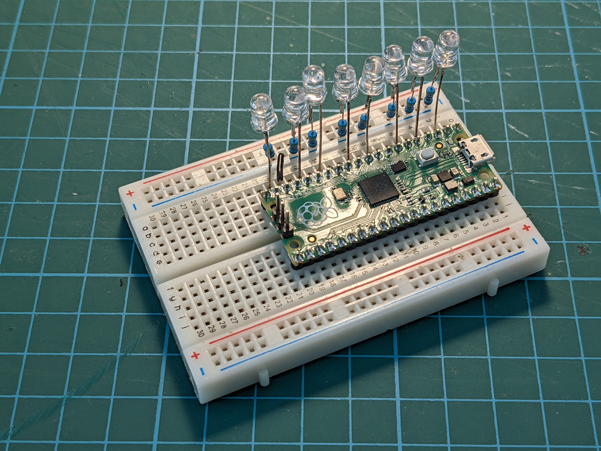

# Blinkenlights

Linux lets you set keyboard LEDs (Caps Lock, Num Lock, Scroll Lock) as indicators for various functions like network activity, disk activity, etc. But my keyboard doesn't have enough LEDs so I made a separate gadget that works as an HID device, except it doesn't have any buttons, only 8 LEDs. These LEDs can be assigned to be indicators for whatever you want, without any additional software running on the computer.

[Demo video.](https://www.youtube.com/watch?v=rhCuniQ734o)

## Setup

The hardware consists of a Raspberry Pi Pico (or any other RP2040-based board) with a number of LEDs connected between its GPIO pins and ground, with current-limiting resistors. The default pin numbers are 1, 2, 4, 6, 8, 10, 12, 14, but that's easy to change in code.

To flash the firmware, hold the BOOTSEL button while connecting the Pico to a PC. A "RPI-RP2" drive should show up. Copy the [blinkenlights.uf2](blinkenlights.uf2) file to that drive.



## How to use

See what LEDs are available.
```
cd /sys/class/leds
ls
```
See which are the ones we just added by filtering on the (fake) USB vendor ID.
```
ls -l | grep CAFE
```
There should be 8 files named something like `input4::numlock`, `input4::capslock`, etc. The number will be different each time. Choose an LED and see what triggers (indicator functions) are available.
```
cd input4::numlock
cat trigger
```
Assign a function to this LED. It should now blink when there's disk activity.
```
echo disk-activity > trigger
```
Some triggers are available right away, but for others you need to load a specific kernel module. See what trigger modules are available.
```
ls /lib/modules/`uname -r`/kernel/drivers/leds/trigger
```
Load the module for network activity.
```
modprobe ledtrig-netdev
```
Some triggers need additional parameters. You set them by writing to files that show up when you select that trigger.
```
echo netdev > trigger
echo 1 > rx
echo 1 > tx
echo enp5s0 > device_name
```
The device name is system specific you will have to substitute with your own. The LED should now blink when there's network activity on that interface.

There are many other triggers for things like CPU activity, mute state of the audio interface/microphone, etc. The `oneshot` trigger is useful for triggering events from userspace.

There are probably ways to make the assignment permanent so you don't have to do it after every reboot.

## How to compile

```
git clone https://github.com/jfedor2/blinkenlights.git
cd blinkenlights
git submodule update --init
mkdir build
cd build
cmake ..
make
```
